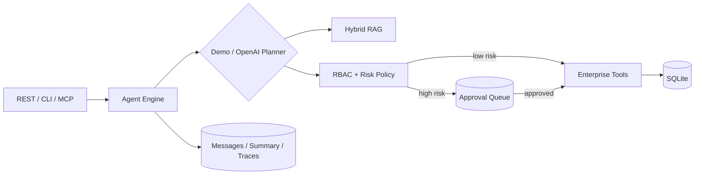

# EnterpriseOps Agent（企业运营智能体）

EnterpriseOps Agent 是一个面向企业运营场景的任务执行服务。它不是简单的聊天接口，而是实现了一个可审计的业务闭环：

> 理解任务 → 检索企业制度 → 选择工具 → 权限判断 → 高风险操作人工审批 → 执行业务写入 → 持久化会话与轨迹

默认 `demo` 模式不需要 API Key，适合本地开发、自动化测试和离线部署；切换为 `openai` 模式后使用 OpenAI Responses API 做动态工具选择。

## 核心能力

- 企业知识库：政策、员工手册、Runbook 的混合检索，结合关键词重合与本地确定性向量相似度。
- Agent 工具调用：查询用户、检索制度、查询/创建/更新工单，统一 JSON Schema 注册。
- 权限治理：employee、manager、admin 三级 RBAC；服务端强制绑定登录身份，防止模型伪造 `creator_id`。
- Human-in-the-loop：P1 工单和敏感更新不会立即执行，而是持久化审批请求并暂停；审批后从断点继续。
- 状态与记忆：SQLite 保存 session、message、summary、approval、ticket 和 trace，进程重启后审批仍可恢复。
- 可靠性：工具超时、最大步数、事务回滚、重复审批拦截、错误状态收敛。
- 可观测性：记录规划、权限决策、工具参数/结果、耗时和异常，可通过 API 查询完整 trace。
- 多种接入方式：FastAPI REST、命令行和 MCP Server 共用同一业务内核。
- 工程化：Pydantic 配置、类型模型、pytest、离线评测集、Docker、健康检查和非 root 容器。

## 架构



安全边界在工具执行层，而不是提示词中。即使模型给出伪造身份或试图直接创建 P1 工单，`PolicyEngine` 和 `_bind_identity` 仍会阻止绕过。

## 目录

```text
enterprise-agent/
├─ src/enterprise_agent/
│  ├─ engine.py          # Agent Loop、审批中断/恢复、超时和轨迹
│  ├─ planner.py         # 离线确定性规划器 + OpenAI Responses 规划器
│  ├─ tools.py           # 企业工具注册与业务实现
│  ├─ policy.py          # 工具 RBAC 和风险策略
│  ├─ retrieval.py       # 混合检索与本地向量
│  ├─ database.py        # SQLite schema、事务和持久化
│  ├─ api.py             # FastAPI 接口
│  ├─ mcp_server.py      # MCP 接入
│  └─ cli.py             # 命令行演示
├─ data/knowledge.json   # 可替换的企业知识样例
├─ tests/                # 核心安全与业务闭环测试
├─ evals/                # Agent 行为评测集和指标脚本
├─ Dockerfile
└─ docker-compose.yml
```

## 本地运行

要求 Python 3.11+。PowerShell：

```powershell
cd "C:\Users\Lenovo\Desktop\agent开发准备\enterprise-agent"
python -m venv .venv
.\.venv\Scripts\Activate.ps1
python -m pip install -e ".[dev]"
Copy-Item .env.example .env
```

### 1. 无 Key 完整演示

```powershell
enterprise-agent "查询 P1 审批制度并创建 P1 工单：生产 API 大面积超时" --approve-as u-2001
```

你会看到两段结果：第一段状态为 `waiting_approval`，数据库内还没有新工单；第二段由经理批准后才真正创建工单。

### 2. 启动 REST API

```powershell
uvicorn enterprise_agent.api:app --reload --port 8000
```

- Swagger：<http://localhost:8000/docs>
- 健康检查：<http://localhost:8000/health>

完整 API 演示：

```powershell
$session = Invoke-RestMethod -Method Post `
  -Uri http://localhost:8000/v1/sessions `
  -ContentType application/json `
  -Body '{"user_id":"u-1001","role":"employee"}'

$result = Invoke-RestMethod -Method Post `
  -Uri "http://localhost:8000/v1/sessions/$($session.session_id)/messages" `
  -ContentType application/json `
  -Body '{"message":"查询制度并创建 P1 工单：生产 API 大面积超时"}'

Invoke-RestMethod -Method Post `
  -Uri "http://localhost:8000/v1/approvals/$($result.approval_id)/decision" `
  -ContentType application/json `
  -Body '{"approved":true,"reviewer_id":"u-2001","comment":"确认升级"}'
```

生产环境把 `.env` 中 `APP_ENV` 设为 `production` 并更换 `API_KEY`，请求同时携带 `X-API-Key`。真实项目建议在 API Gateway 接入公司 SSO/OIDC，而不是把示例 API Key 当作最终用户认证方案。

### 3. 使用 OpenAI 规划器

```dotenv
AGENT_MODE=openai
OPENAI_API_KEY=sk-...
OPENAI_MODEL=gpt-4.1-mini
```

其余接口不变。模型只负责规划与参数生成；权限、审批、身份绑定和副作用仍由确定性的服务端代码控制。

### 4. 作为 MCP Server

```powershell
enterprise-agent-mcp
```

可把命令配置进支持 stdio MCP 的客户端。MCP 暴露检索和受治理的 Agent 入口，高风险工具仍必须走审批，不能从 MCP 绕过。

### 5. Docker

```powershell
Copy-Item .env.example .env
docker compose up --build
```

SQLite 数据保存在命名卷 `agent-data` 中。

## 测试与评测

```powershell
pytest -q
python evals/run.py
```

单元/集成测试覆盖：P1 操作审批前无副作用、批准后执行、拒绝不执行、普通员工不可审批、角色冒充拦截、RAG 命中和 trace 完整性。评测脚本输出通过率及每个案例的状态和工具路径；它使用临时数据库，不污染演示数据。

## 可继续接真实企业系统的位置

- 把 `EnterpriseTools` 中 SQLite 实现替换成 Jira、ServiceNow、飞书或内部工单 REST API。
- 把 `HybridRetriever` 替换为 pgvector、Milvus 或 Elasticsearch，并加入文档分块与增量索引任务。
- 在网关接 OIDC/JWT，把 `user_id` 和 `role` 从可信身份令牌传入，不接受客户端自报角色。
- 把 trace 接到 OpenTelemetry/Langfuse，把 SQLite 换成 PostgreSQL，并使用 Redis 做分布式锁和幂等键。
- 对真实写操作增加 outbox、补偿事务、限流、熔断与告警。

这些属于生产基础设施集成，不影响当前项目的本地运行，但在部署到生产环境前应完成相应改造。

## 设计要点

- 权限控制位于工具执行层，不能依赖 Prompt 保证安全。
- 高风险操作先持久化审批请求，审批通过前不产生业务副作用。
- 会话、审批和执行轨迹统一持久化，使中断任务能够跨进程恢复。
- 离线规划器与在线模型使用相同的工具和策略层，保证测试与生产路径的一致性。

